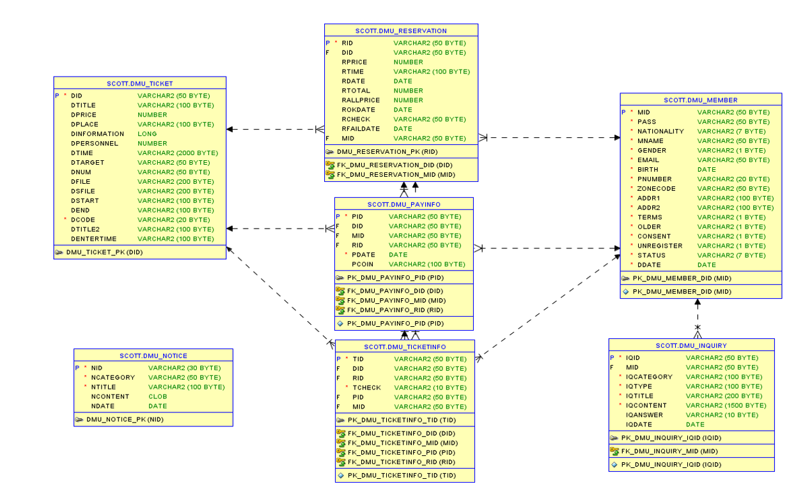

# D'MUSEUM
## 📌 프로젝트 개요

**전시회 및 문화 관련 프로그램 티켓 예매 사이트인 D'MUSEUM 벤치마킹**

### 👩‍💻 구성원
* 심수연
* 안재형
* 이유진
* 추민우

### 선정이유
* 문화전시산업 수요 증가
* 예약 서비스 응용
* 데이터 CRUD와 다양한 이벤트 처리

### 개발 정보
* **Language**
  * HTML/CSS
  * Java Script(JQuery, JSON, AJAX)
  * JAVA
  * JSP/JSTL
  * SQL

* **Collaboration & Tools**
  * Spring Framework
  * Oracle Database 11g
  * SQL Developer
  * JQuery UI
  * Git/GitHub

## 📌 ERD

